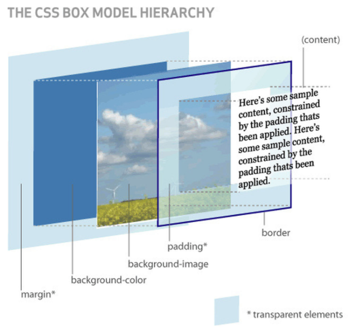

# 学习资料
[前端进阶之旅](https://interview.poetries.top/)
[前端面试官系列](https://vue3js.cn/interview/)
[手写题仓库](https://github.com/Sunny-117/js-challenges)
# css
#### 什么是css
CSS 是 Cascading Style Sheets（层叠样式表）的缩写，是一种用来描述 HTML 或 XML（包括如 SVG、XHTML 等各种 XML 文档）文档样式的样式表语言。**它主要用于控制网页内容的表现形式，比如字体、颜色、间距、布局等视觉效果。**

CSS 的主要功能和特点包括：

1. **分离内容与表现**：通过将网页的内容（通常用 HTML 编写）与设计（使用 CSS 控制）分开，使得网站维护更加容易，并且有助于提高可访问性。

2. **级联性**：当存在多个规则应用于同一元素时，CSS 会根据一定的优先级来决定哪个规则生效，这种机制被称为“级联”。

3. **继承性**：某些样式可以由父元素传递给子元素，这样就可以减少重复设置样式的工作量。

4. **灵活性**：可以通过媒体查询等技术实现响应式设计，让页面在不同设备上都有良好的显示效果。

5. **易于更新**：只需要修改一处 CSS 文件，所有引用该文件的页面都会相应地更新样式，这比直接在每个 HTML 文件中编写样式要方便得多。

6. **增强用户体验**：合理利用 CSS 可以创建更吸引人的用户界面，提升用户的浏览体验。

#### css的特性
1. 层叠性：同一元素的选择器，后面的样式会覆盖前面的
  ````
  //这里div的字体颜色会是pink
       div {
           color: red;
           font-size: 12px;
       }
       div {
           color: pink;
       }
  ````
2. 继承性

案例1：字体颜色继承
````
    div {
        color: pink;
        font-size: 14px;
    }
````
````
//这里p会继承父元素div
    <div>
        <p>我的字体会是粉色</p>
    </div>
````
案例2：行高继承

````
    <style>
        body {
            color: pink;
            /* font: 12px/24px 'Microsoft YaHei'; */
            font: 12px/1.5 'Microsoft YaHei';
        }

        div {
            /* 子元素继承了父元素 body 的行高 1.5 */
            /* 1.5*14 = 21 */
            font-size: 14px;
        }

        p {
            /* 1.5 * 16 =  24 当前的行高 */
            font-size: 16px;
        }

        /* li 么有手动指定文字大小  则会继承父亲的 文字大小  body 12px 所以 li 的文字大小为 12px 
        
        当前li 的行高就是  12 * 1.5  =  18
        */
    </style>
````
````
<body>
    <div>粉红色的回忆</div>
    <p>粉红色的回忆</p>
    <ul>
        <li>我没有指定文字大小</li>
    </ul>
</body>
````

#### css权重
1. 类、属性和伪类选择器：包括 .class、[attribute] 和 :pseudo-class 等。
2. ID选择器：使用 #id 选择器指定的样式次之。
3. 元素类型选择器和伪元素：如 div、p 或 ::before。
4. 内联样式：直接写在HTML标签上的style属性具有最高的优先级。
5. !important 
6. css继承


每个等级的权重值分别是：

内联样式：1,0,0,0
ID选择器：0,1,0,0
类/属性/伪类选择器：0,0,1,0
元素/伪元素选择器：0,0,0,1
!important：无穷
继承：0,**即使父元素css有!important继承权重也是0**

##### <font color=red>注意</font>
1. 复合选择器会有权重叠加的问题 
2. 权重虽然会叠加,但是永远不会有进位 

#### css盒子模型
##### 是什么
当对一个文档进行布局（layout）的时候，浏览器的渲染引擎会根据标准之一的 CSS 基础框盒模型（CSS basic box model），将所有元素表示为一个个矩形的盒子（box）
一个盒子由四个部分组成：content、padding、border、margin


box-sizing 属性定义了引擎应该如何计算一个元素的总宽度和总高度
1. **box-sizing: border-box; 怪异盒子**
width/height **包含**了 padding和 border值
盒子总宽度 = width + margin;
盒子总高度 = height + margin;
2. **box-sizing: content-box; 标准盒子**
width/height 只是内容高度，**不包含** padding 和 border值
盒子总宽度 = width + padding + border + margin;
盒子总高度 = height + padding + border + margin

#### 清除内外边距
    * {
        margin: 0;
        padding: 0;
    }
将所有元素的默认外边距（margin）和内边距（padding）设置为0。这样做的主要目的是消除浏览器对不同元素所应用的默认样式，这些默认样式可能会导致布局不一致或不符合设计预期。

#### 清除行内块元素中间的缝隙
在CSS中，行内元素（包括转换为inline-block的元素）之间默认会有一个空白间隙，这是因为HTML中的空格、换行符等被浏览器解析为了一个空白字符。当这些元素变成inline-block时，这个空白字符也会占据一定的空间，从而导致元素之间出现了缝隙。
###### 清除方法：float: left;

#### 圆角边框
    .round {
        width: 200px;
        height: 200px;
        background-color: pink;
        /* border-radius: 100px; */
        /* 50% 就是宽度和高度的一半  等价于 100px */
        border-radius: 50%;
    }

#### 浮动